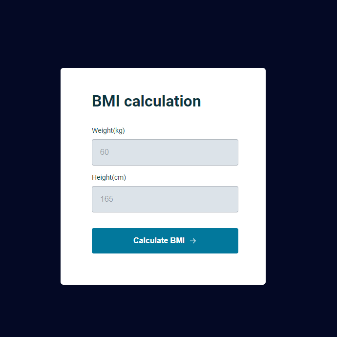
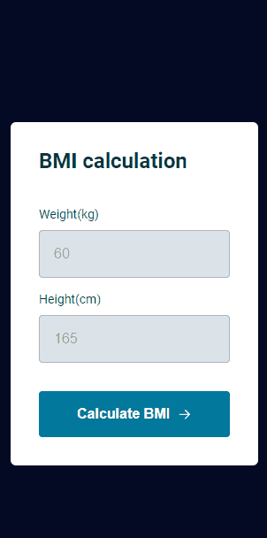

# BMICalculator2
This new project is an improvement of the old project, using new techniques I learned, and integrating JS, HTML and CSS with it.

Those techniques include:
- Exporting and importing other scripts to a javascript module.
- Using CSS and responsiveness to built a new site for the program.
- Creating multiple functions and variables, and linking with querySelector to the HTML id's and classes.
- More responsiveness to multiple platforms, and and with greater use of accessibility.

The project is available at: [https://bmi-calculator2.vercel.app/](https://bmi-calculator2.vercel.app/)

